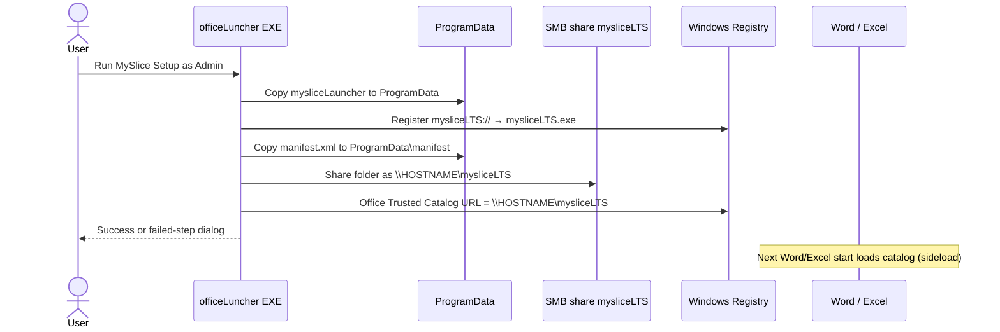
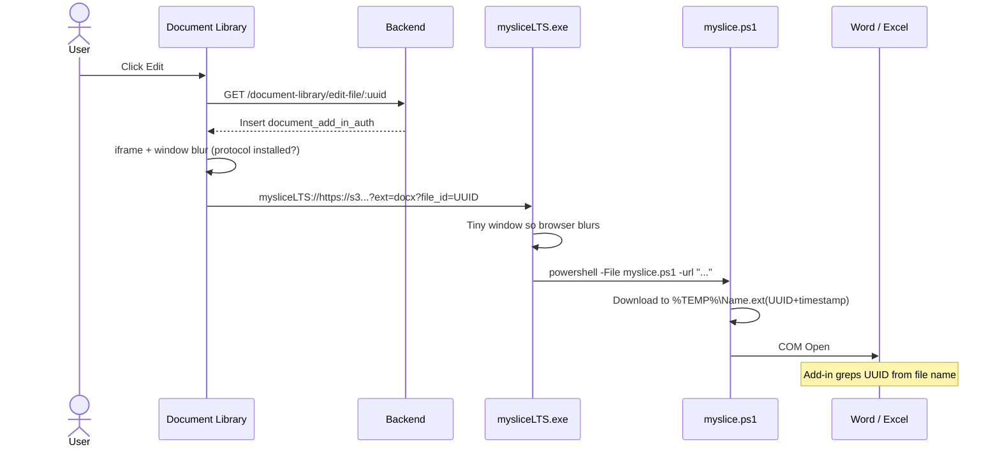

# Installer and launcher flow (rootLuncher)

This repo is the **Windows EXE half** of MySlice Office Add-in: install once, then handle every Document Library **Edit** click.

Add-in UI, token bind, and save-to-S3 are documented in:

`MY NEW X1 OFFIce ADD INS/markdown/`

---

## Why two packages (one Electron app)

MySlice Document Library has no login screen inside Word. The web app is already authenticated. Desktop only needs to:

1. Make Office trust and load the add-in (install time).
2. Download a Document Library file and open it in Word/Excel (every Edit).
3. Put the file UUID in the **temp file name** so the add-in can bind a short-lived office session.

| App | When | Window | Role |
| --- | --- | --- | --- |
| `officeLuncher` | Once, as Administrator | NSIS dialogs | Deploy launcher, SMB share, registry, `mysliceLTS://` |
| `mysliceLauncher` | Every Edit | Hidden (tiny focus-stealer) | Parse protocol URL, run `myslice.ps1`, open Office |

`officeLuncher` is **NSIS only**. It packs the already-built `mysliceLauncher` (one Chromium). It is not a second Electron app.

---

## Installation (`officeLuncher/install.ps1`)

NSIS: `requestedExecutionLevel: requireAdministrator`. Install dir is `C:\ProgramData\myslice\mysliceLTS\launcher`.



### Steps

1. **Deploy launcher**  
   NSIS installs `mysliceLTS.exe` to `C:\ProgramData\myslice\mysliceLTS\launcher\`  
   Includes `mysliceLTS.exe` and `resources/myslice.ps1`.

2. **Register `mysliceLTS://`**  
   `HKEY_CLASSES_ROOT\mysliceLTS`  
   Command: `"C:\ProgramData\myslice\mysliceLTS\launcher\mysliceLTS.exe" "%1"`

3. **Deploy manifest**  
   Packaged `manifest.xml` → `C:\ProgramData\myslice\mysliceLTS\manifest\manifest.xml`  
   `SourceLocation` is the hosted taskpane on S3, not this EXE.

4. **SMB share** (required for Office trusted catalog on Windows)  
   Share name `mysliceLTS`, path `...\manifest`.  
   Current code: `Everyone` / `FullControl`.

5. **Trusted catalog**  
   `HKCU\Software\Policies\Microsoft\Office\16.0\WEF\TrustedCatalogs\{c77550fc-0d50-495e-be1a-8695539e5d54}`  
   `Url` = `\\COMPUTERNAME\mysliceLTS`, `Flags` = `1`.

6. Dialog, then quit. Restart Word/Excel.

## Uninstall

NSIS uninstaller (Settings → Apps → **MySlice**). Runs `officeLuncher/uninstall.ps1` then deletes the install dir.

```bash
cd officeLuncher
npm run start:uninstall
```

Run **as Administrator**. It removes:

- process `mysliceLTS.exe` (and `myslice.ps1` PowerShell)
- SMB share `mysliceLTS`
- protocol `HKEY_CLASSES_ROOT\mysliceLTS`
- Office trusted catalog `{c77550fc-0d50-495e-be1a-8695539e5d54}`
- `C:\ProgramData\myslice\mysliceLTS` (and empty `myslice` parent)

Dev: `npm run start:uninstall`

### What “sideload” means

Not Visual Studio / `office-addin-debugging`.

It is Microsoft’s **network-share catalog** for Windows desktop Office: Office reads `manifest.xml` from `\\PC\mysliceLTS`; HTML/JS load from HTTPS. Centralized Deployment is not used because the add-in has no login UI and only applies to files this EXE opens.

---

## Edit launch (`mysliceLauncher`)

Web (Document Library → Edit, not PDF):

```text
mysliceLTS://<s3-file-url>?ext=<docx|xlsx|pptx>?file_id=<uuid_file_id>?origin=<myslice-hrms|myslice-seal|myslice-ats>
```

`origin` is `myslice-hrms`, `myslice-seal`, or `myslice-ats`. Mode is inferred from that slug. Optional `?p=<base64>` is parsed in PowerShell.



### `mysliceLauncher/main.js`

1. Single-instance lock; second launch forwards the URL.
2. Default protocol client for `mysliceLTS`.
3. Extract URL from `argv` (Windows) or `open-url` (macOS).
4. 200×200 transparent window ~100ms (web blur detector).
5. Strip `mysliceLTS://`, pass remainder to PowerShell.
6. Quit **only when every PowerShell child has exited** (two Edits → two `myslice.ps1` → EXE stays until the last Office window from this protocol closes).

Packaged script path: `process.resourcesPath\myslice.ps1`  
(installed: `C:\ProgramData\myslice\mysliceLTS\launcher\resources\myslice.ps1`)

### `myslice.ps1`

1. Force `https://`.
2. Parse `file_id`, `ext`, optional `p`.
3. Temp name:

   ```text
   {cleanedName}.{ext}({fileId}+{yyyyMMddHHmmss}+{origin})
   ```

   Example: `Contract.docx(7ac86ae0-404b-43c2-b9d9-e6c178dc4b94+20260825101422+myslice-hrms+document)`

   UUID is still the Document Library file id. Origin/mode select API + ribbon.

4. `Invoke-WebRequest` → `%TEMP%`.
5. Extension must be `docx` / `xlsx` / `pptx`; else exit.
6. Open via COM:
   - Word: `Documents.Open`, hidden space, wait until **this** document’s windows = 0. `Quit` only if this Application has no documents left.
   - Excel: `Workbooks.Open`, wait until **this** workbook is closed. `Quit` / kill PID only if that instance has no workbooks left.
   - PowerPoint: same isolation; add-in ribbon is Word/Excel only.
7. Delete temp file on close.

After open, the add-in runs `tokenInitialization()` → `POST /document-library/check-fid`. See add-in `markdown/03-edit-save-close.md`.

---

## Layout

```text
rootLuncher/
  officeLuncher/          # NSIS installer (packs prebuilt launcher)
    install.ps1
    uninstall.ps1
    installer.nsh
    manifest.xml          # Copied to ProgramData share (S3 taskpane URLs)
    package.json
  mysliceLauncher/        # Protocol handler (the only Electron app)
    main.js
    myslice.ps1
    package.json
  markdown/
    INSTALLER-AND-LAUNCHER-FLOW.md
```

Build:

```bash
cd mysliceLauncher && npm install && npm run build
cd ../officeLuncher && npm install && npm run dist
```

Output: `officeLuncher/dist/MySlice Setup 1.0.0.exe`

---

## Failures

| Symptom | Likely cause |
| --- | --- |
| Web: “myslice not found” | Protocol not registered, or no blur within 1s |
| Word opens, empty ribbon | Catalog/share/registry missing; Word not restarted; GPO overwrote Policies hive |
| Add-in loads, APIs 401 | `edit-file` did not insert `document_add_in_auth`, or `check-fid` empty |
| Extra Excel.exe | COM vs existing Excel (script tries to kill the new PID) |
| Installer “Network share failed” | Not Admin, SMB disabled, share name taken |

Legal / enterprise notes: add-in repo `markdown/05-legal-and-enterprise.md`.
